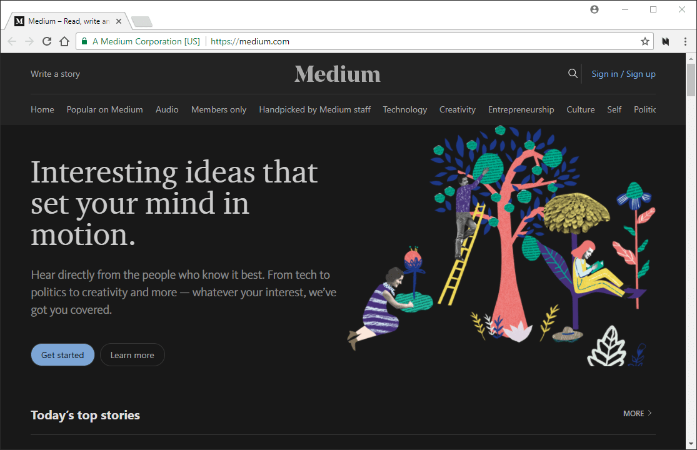
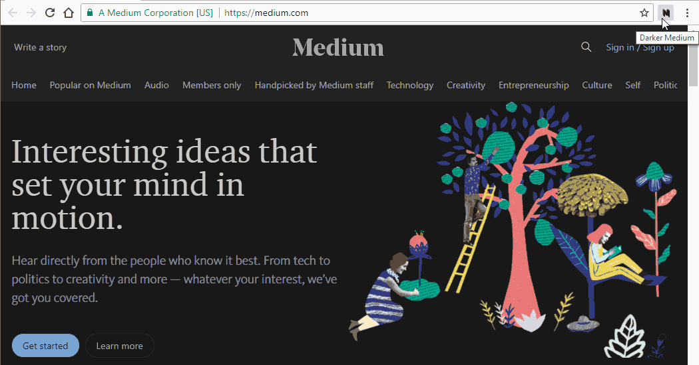
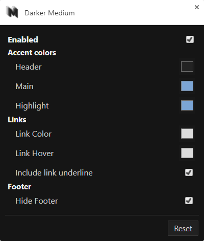

#  Darker Medium [![tags][tag-img]][tag-url] [![devDependency Status][david-dev-img]][david-dev-url]

[tag-url]: https://github.com/Mottie/Darker-Medium/tags
[tag-img]: https://img.shields.io/github/tag/Mottie/Darker-Medium.svg
[david-dev-url]: https://david-dm.org/Mottie/Darker-Medium#info=devDependencies
[david-dev-img]: https://david-dm.org/Mottie/Darker-Medium/dev-status.svg

Read Medium stories with happy eyes!

## Contents

* [Features](#features)
* [Security Concerns](#security-concerns)
* [Branding](#branding)
* [Installation](#installation)
  * [Extension](#extension)
  * [Usercss](#usercss)
* [Usage](#usage)
  * [Toggle the style (temporarily)](#toggle-the-style-temporarily)
  * [Customize accent colors](#customize-accent-colors)
* [Contributing](#contributing)
* [Reporting problems](#reporting-problems)
  * [Style issues](#style-issues)
  * [Other issues](#other-issues)

## Features

* Applies a customizable dark theme to all medium formatted stories.
* Customize:
  * Header background.
  * Main Accent color.
  * Highlighting color.
  * Link color, hover and underline.
  * Hiding the "get updates" footer.
* Adds syntax highlighting to code and styles embedded [gists](https://gist.github.com/).
* Medium story sites are *automatically* detected and styled.
* The advantage of using this extension over [Stylus](http://add0n.com/stylus.html) or Stylish is that you install it, customize it and forget about it.
* Please see [this wiki page](https://github.com/Mottie/Darker-Medium/wiki/Tested-pages) for a list of sites that were tested for this extension.
* A user.css file is available, and once Stylus has implemented [support for user.css files](https://github.com/openstyles/stylus/pull/134), it will be immediately usable and installable from this repository.

## Security Concerns

This browser extension **does not collect any personal data**.

The only data stored is the user style preferences (the state of the extension, five colors &amp; an underline setting). Absolutely nothing else is shared or tracked; not even Google Analytics.

## Branding

Apologizes to the sites that use specific colors in their branding, this extension overrides all of your colors; and it definitely doesn't touch your logo!

For example, I love hackernoon.com, but your bright green header and banners make my eyes scream when I try to read your site at night. This web extension applies an overall dark theme to all sites including those bright headers.

## Installation

### Extension

Install it for:
* [Chrome](https://chrome.google.com/webstore/detail/darker-medium/ffhffkeoooocikeclopcedglnjhoddfj)
* [Firefox](https://addons.mozilla.org/en-US/firefox/addon/darker-medium/)
* [Opera](https://addons.opera.com/en/extensions/details/darker-medium/)
* Safari (Help wanted; See [issue #1](https://github.com/Mottie/Darker-Medium/issues/1))

### Usercss

[Stylus](http://add0n.com/stylus.html) supports user.css file formats. When a "raw" version of `darker-medium.user.css` from this repository (link below) is opened in the browser, Stylus will prompt you to install the style. For more details, see the [usercss documentation](https://github.com/openstyles/stylus/wiki/Usercss).

The **advantages** of using a usercss are as follows:

* No intermediary domain is needed to host the usercss file.
* Updates will be immediately available.
* Style customization is built-in. The same customizations for the extension are also available.

The **disadvantage** of this specific usercss is:

* Syntax highlighting is not applied to code snippets, because it requires JavaScript processing.
* Medium stories on unlisted domains will not be styled. If you want to report an unstyled Medium domain, please look in the [other issues](#other-issues) section for more details. A list of currently supported sites can be found in the [`medium-sites.js` file](./build/medium-sites.js).

**NOTE**: The version number of the available web extension may lag behind the usercss because the usercss style needs updating to add more sites, while the web extension will detect them automatically.

## Usage

### Toggle the style (temporarily)

Click on the Darker Medium icon to toggle the dark style on and off *temporarily* for the visible page. This state is not stored; this may be added in a future update.

### Customize accent colors

Open the Extension options (all settings are stored):

* `Enabled` - This is a global toggle of the Darker Medium extension.
* `Header` - Customize the background color of the page header.
* `Main` - Customize the main accent color. This is overrides the branded color of the site.
* `Highlight` - Customize the highlighted text background color. The text color is automatically adjusted as needed.
* `Link Color` - Customize all link colors. This may include icons as well as links within the article.
* `Link Hover` - Customize the link hover color.
* `Include link underline` - Include or hide link underlines.
* `Reset` - Restore the default settings.

## Contributing

If you would like to contribute to this repository, please refer to the [contribution guidelines](./.github/CONTRIBUTING.md).

And don't worry if you've never contributed to an open-source project before, you can start by reading [this friendly guide](https://github.com/Roshanjossey/first-contributions#readme).

**This project is bound by a [Code of Conduct](./.github/CODE_OF_CONDUCT.md)**.

## Reporting problems

[![gitter-image]][gitter-url]

### Style issues

* If it's a public page, you'll only need to report the URL and any steps needed to show the problematic area.
* If you need a membership to access the page, then please include the HTML and related CSS:
  * First, you'll need to right click on top of the element, and select "Inspect" or "Inspect Element".
  * The Developer Tools panel will open.
  * Make sure the highlighted element and the element above it are visible in the panel.
  * Look to the right side of that panel and you should find the "Styles" (or "Rules") tab.
  * Now look for the problematic style (usually a `background-color` or `color`).
  * Share the HTML/CSS by either:
    * Copy/pasting the HTML and associated CSS into a new issue, OR
    * Take a screenshot of the development panel (if you need an app, try http://getgreenshot.org/downloads/).
* If these instructions aren't clear enough, or you want to contact a person, use Gitter (click the button above) for this repository.

[gitter-url]: https://gitter.im/Darker-Medium
[gitter-image]: https://img.shields.io/badge/GITTER-join%20chat-yellowgreen.svg

### Other issues

* Please report:
  * If public, and pertinent, please share the URL of the page with the problem.
  * Report any javascript error as seen in the development tools console (Press <kbd>F12</kbd> to open it).
  * Any extra information as described in the issue template when a new issue is opened.
* Do you know how to solve it? It'd be awesome if you [contributed a fix](./.github/CONTRIBUTING.md)!
